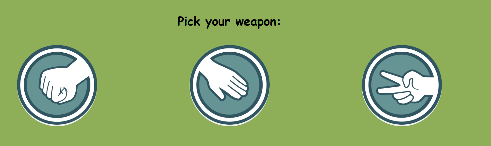
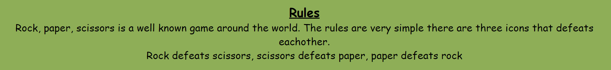
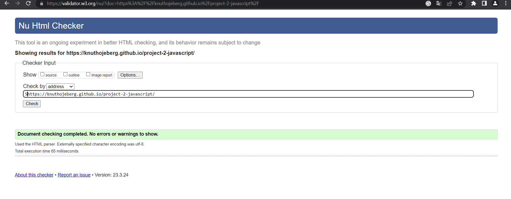
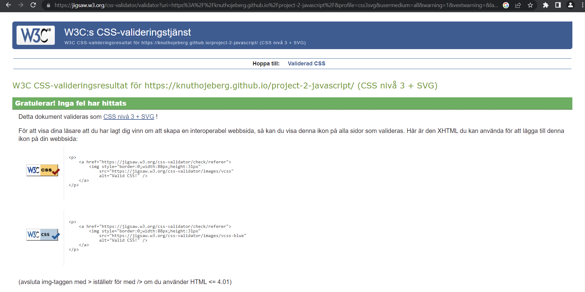
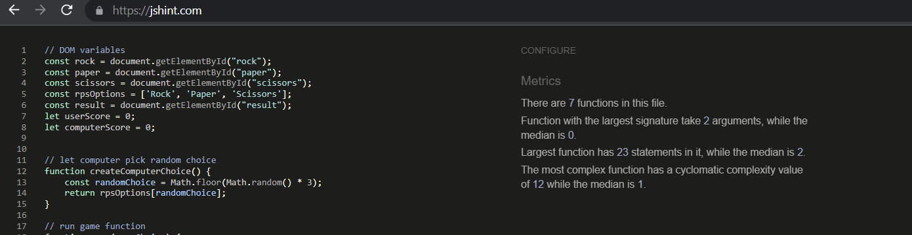
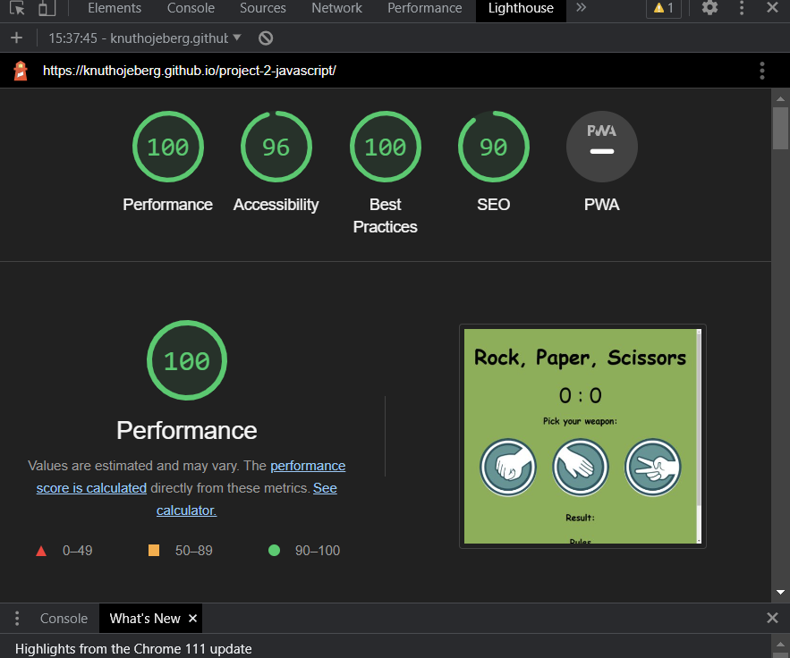

project-2-javascript

This website was designed to let people play the famous game "Rock, paper, scissors". The webside is one site which gives the user three diffrent options as "weapons", rock, paper and scissors. The user gets to choose one of the three options then the computer chooses one and the out come is displayed in the "results" section and the score is updated on the score board.

The page lets the user start playing the game right away. The page contains a header with the name of the game, "Rock, paper, scissors" and then three options with pairing pictures which is "Rock, paper, scissors". Above the three choices is an scoreboard which keeps count of the score to create a more competetive experience while playing the game. Below the three choices is a results bar which displays the outcome of the last played round. Lastly at the bottom is a short description of the rules. 

This website is the second of five projects that must be completed to earn a Diploma in Software Development from The Code Institute.

Requirements for the project are that the website must be static and responsive with HTML5, CSS3 and JavaScript. A live version of the site can be found here: https://knuthojeberg.github.io/project-2-javascript/

Table of Contents
UX
User Demographic
User Goals
Design
Colour Scheme
Typography
Images
Features
Welcome page and start button
Quiz Header
Quiz Section
Technologies Used
Testing
Validator testing
Testing and bugs
Media
Deployment
Acknowledgements
Sources
UX
User Demographic
This site has been designed for users of all ages to play the famous game, "Rock, paper, scissors".

User Goals
To play the fun game Rock, paper, scissors.
To have fun.
Design
The background color was choosed to be an calming and playful color due to the demograhpic of the game. This came out to be a dark green color.

Colour Scheme
The website used for the choice of color was https://www.w3schools.com/colors/colors_palettes.asp

Typography
The fonts used for this project were from https://fonts.google.com/

Images
The images have been selected according to the purpose of the buttoms where the pictures were used.

Features
Header
Game Area
Score board
Rules

The header consists of the name of the game, "Rock, paper, scissors".

Game Area
The game area contains the three choices you can make to play the game. You use them through clicking the buttom of the "weapon" you want to use.

Score board
The score board counts the out come of the games played. This is dictated by the "reults" bar which is located below the "weapons".

Rules
At the bottom of the site is a short text paragraph that explains the simple rules needed to play and understand the game

Technologies Used
HTML
CSS
JavaScript
Testing
Validator testing
HTML
No errors were found using W3C HTML validator testing.

CSS
No errors were found using W3C CSS validator testing.

JavaScript
No errors were found using jShint validator testing.

Lighthouse testing

Testing and Bugs
No bugs were detected through out the tests listed above.
Deployment
The development platform used for this project was GitPod. To track the development stage and handle version control regular commits and pushes to GitHub has been conducted. The GitPod environment was created using a template provided by Code Institute.

The live version of the project is deployed at GitHub pages.

The procedure for deployment followed the "Creating your site" steps provided in GitHub Docs.

*Log into Github. *Select the correct GitHub Repository to be deployed live. *Underneath the repository name, click the “Settings” option. *In the sub-section list on the left, under “Code and automation”, click “Pages”. *Within the ”Source” section choose ”main” as Branch and root as folder and click ”Save”. *The page refreshes and a website shall then deploy via a link.

The live deployed link can be found here - https://knuthojeberg.github.io/project-2-javascript/

Media
All images used for this website were found at: https://icon-library.com/

Acknowledgements
For inspiration, for code, design help and advice, I'd like to thank;

Brian O'hare

My mentor at Code Institute.
The Code Institute.

Sources
Sites that provided me with helpful information and resolved many of my issues; https://www.w3schools.com/ https://stackoverflow.com/ https://youtube.com/

The top screen shot for responsive design was taken from:

https://ui.dev/amiresponsive
Thank you

Back to top